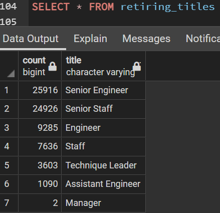
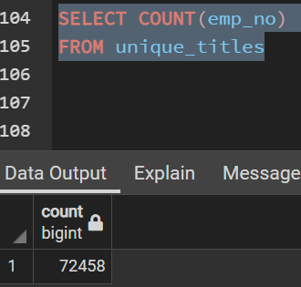
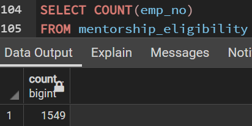

# Pewlett-Hackard-Analysis
## Purpose

The purpose of this analysis is to determine how Pewlet-Hackard will transition into the future considering the number of employees who are coming up to retirement age. There are concerns about whether there are enough skilled retirement age employees to to train the youngers generation as well as whether there are enough young employees to fill the roles of the retirees.

## Results

* The retirement_titles csv shows 7 different positions employees will be retiring from, which are shown below.

* Based on the retiring_titles csv file, most of the retiring individual hold the role of senior engineer or senior staff. 
* This means they will be losing a lot of leadership and high experience individuals.
* The mentorship_eligibility csv gives us 1549 employees eligible for mentorship program for promotion.
* Pewlet-Hackard faces a severe problem in not having the number of promotable employees to fill the vast number of retirees in   the "silver tsunami".
 
 ## Summary
 
The number of retiring employees based on the unique_titles csv, there are 72,458 unique employees who are retiring. This is substantially more than h=those available to be mentored.

As a result, it can be said that Pewlett-Hackard may have to look to external sources to find experienced individuals to fill the gaps as a result of the silver tsunami. There are a lot of retiring employees available to mentor, but not enough future leaders to fill their positions.
